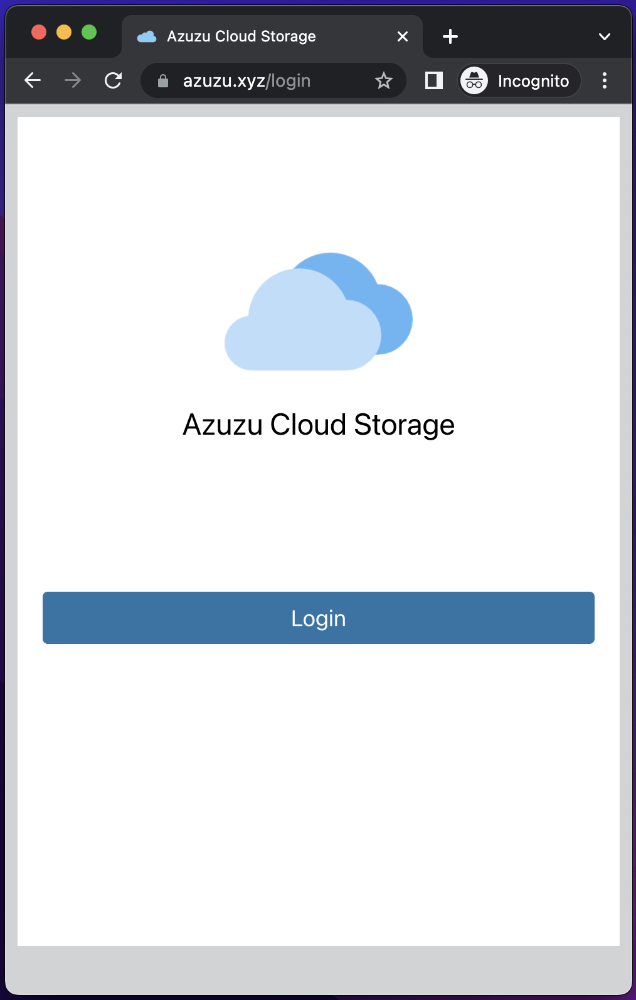
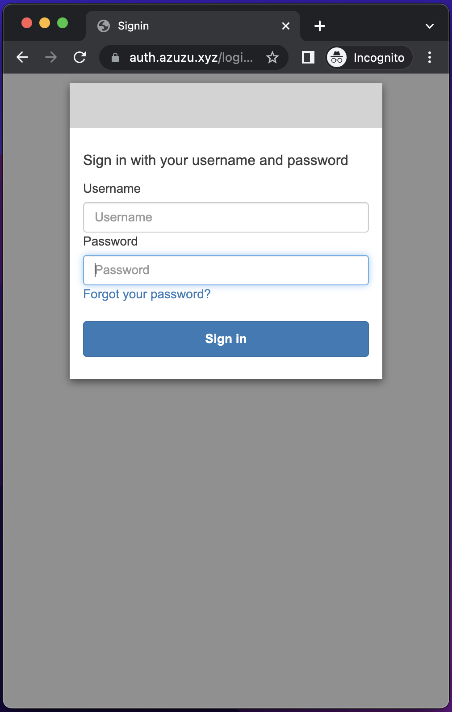
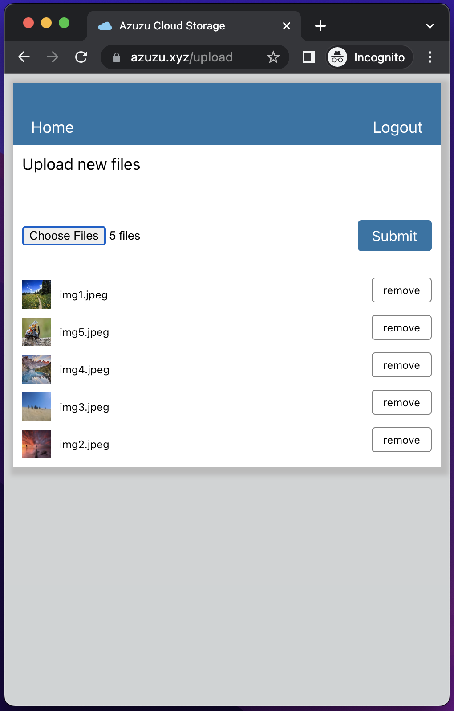
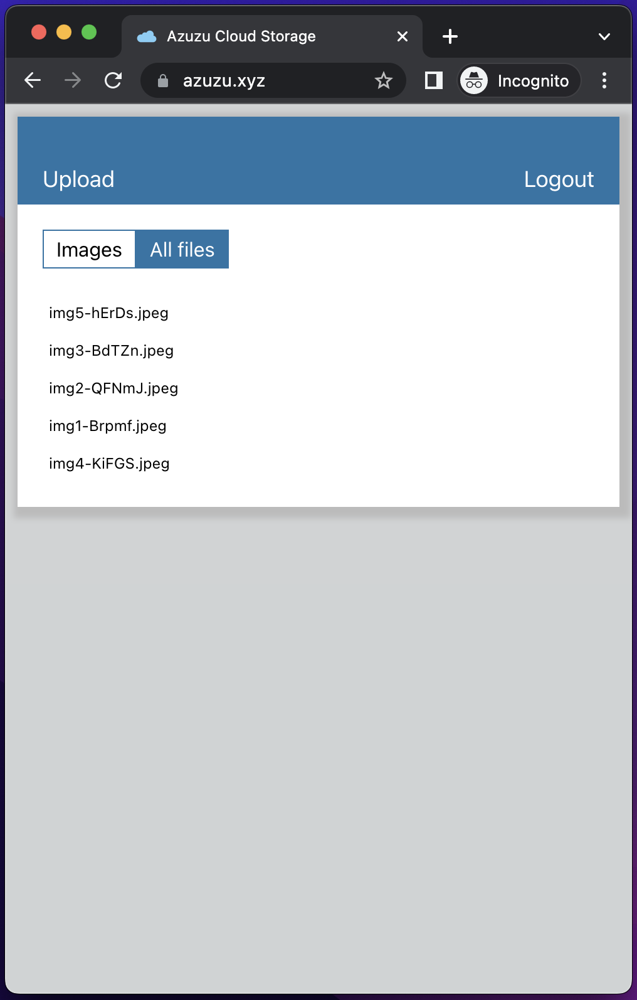
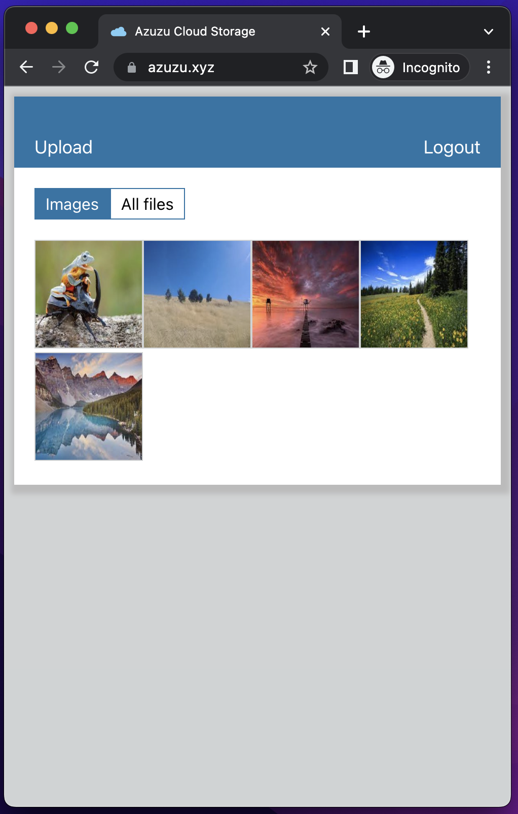
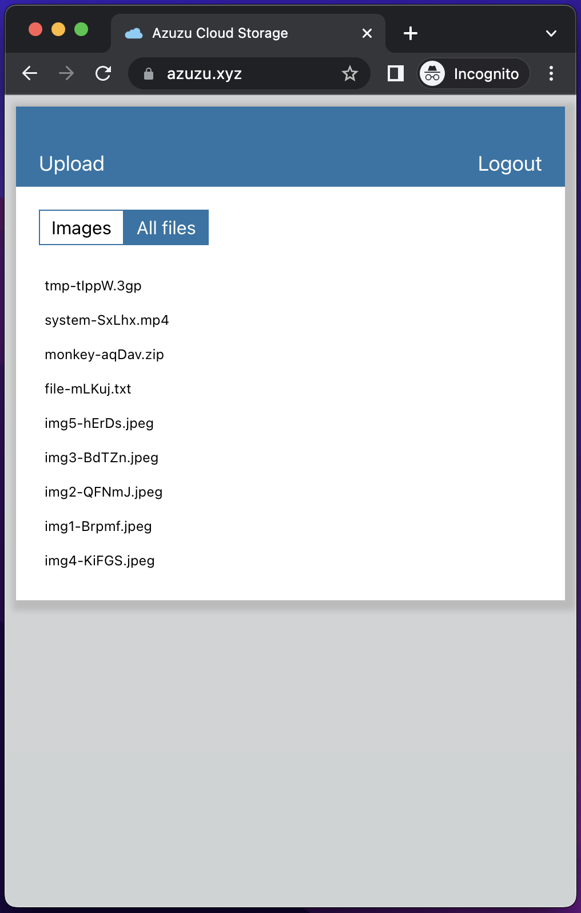
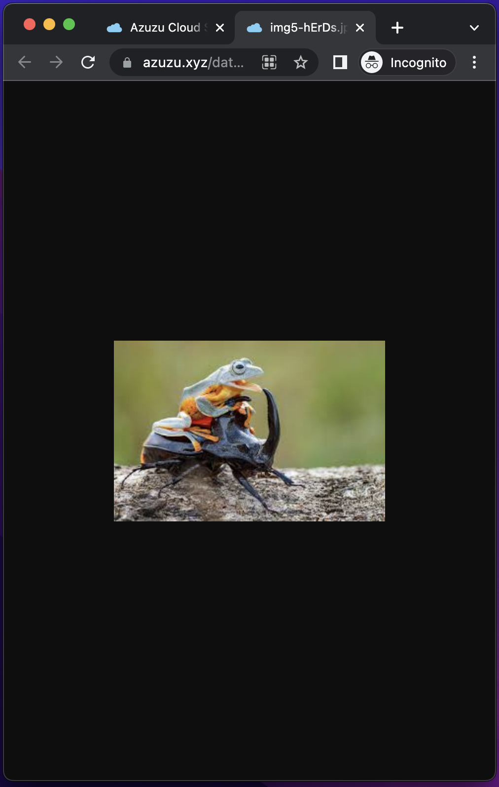

# Azuzu Cloud Storage
A simple file storage built with ReactJS and AWS services. Highly available and purely serverless!

## Background
I built this personal project to practically exercise my knowledge in AWS after passing the following certificates
1. 
1. 
1. 

## Facts
1. Static website is hosted using S3 and Cloudfront
1. Objects are stored to AWS S3
1. Uses AWS Cloudfront as CDN/Caching
1. Uses AWS Certificate Manager for SSL
1. Uses DynamoDB as database
1. Uses S3 Event to trigger an Lambda function that will write data to DynamoDB table
1. Uses AWS Lambda for creating Cloudfront Signed URL
1. Uses AWS Cognito User and Identity Pool for user authentication
1. Domain is hosted in Namecheap

## Screens

